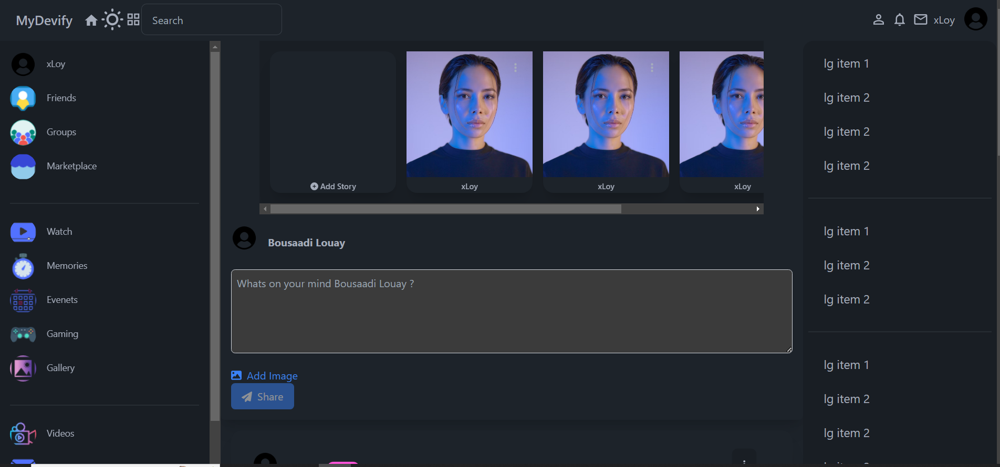
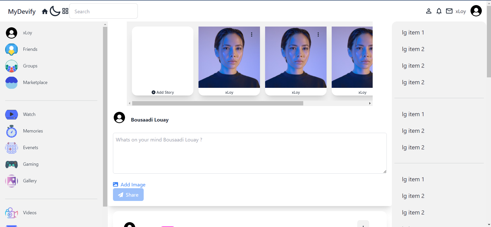
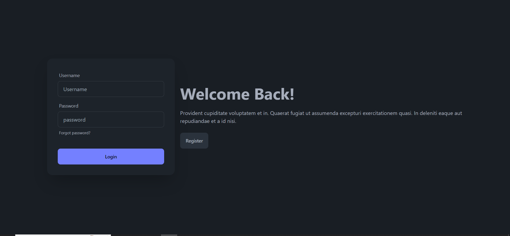
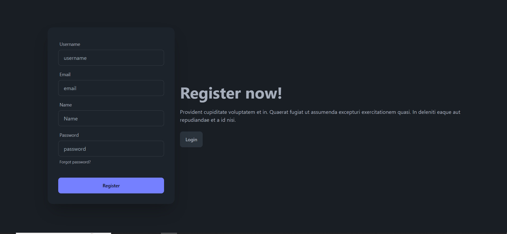
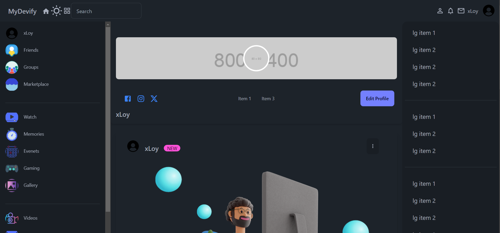
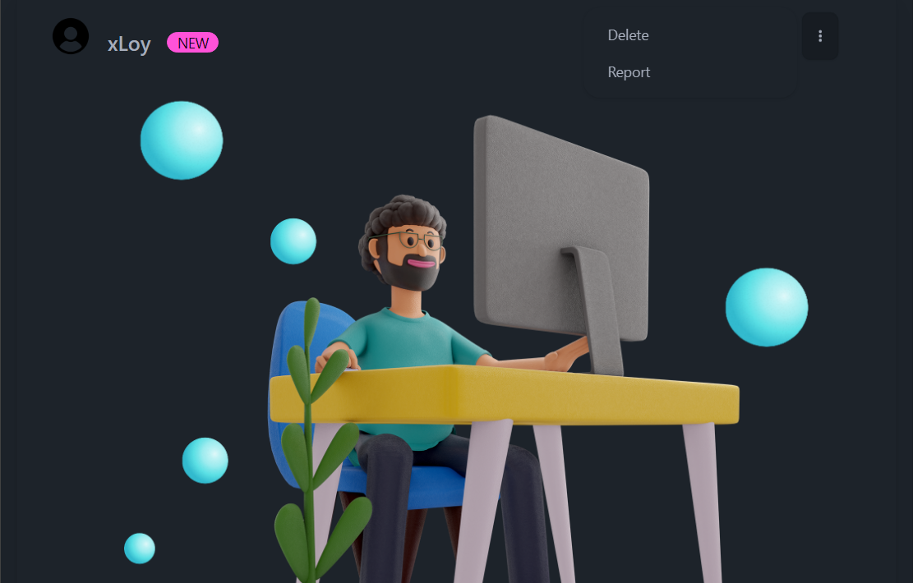




#### ~~This GitHub open-source project isn't fully prepared for use yet; I'm still actively refining the code to enhance its functionality. Additionally, I'll be updating the MySQL database structure soon.~~

#### Great news! This GitHub open-source project is now fully prepared for use. Dive in and explore its features!


## SocialPulse 2024 React Node.js MySQL Social Media App Open Source

### Full Stack Social Network App | Open Source

This repository contains the source code for SocialPulse, a full-stack social media application built using React.js, daisyUI, Tailwind CSS, Express.js, Node.js, MySQL, and React Query. SocialPulse provides a comprehensive platform for users to connect, share posts, interact with friends, and engage in social networking activities.


### ShowCase:
- **Homepage Dark Mode**:

  


- **Homepage Light Mode**:

  


- **Login Page**:

  


- **Register Page**:

  


- **Profile**:

  


- **Manage Settings**:

  


- **Manage Post**:

  

- **And many more features such as creating and managing stories, etc...**


### Technologies Used:

- **React.js**: A JavaScript library for building user interfaces.
- **daisyUI**: A Tailwind CSS component library for rapid UI development.
- **Tailwind CSS**: A utility-first CSS framework for creating custom designs.
- **Express.js**: A web application framework for Node.js used for building RESTful APIs.
- **Node.js**: A JavaScript runtime environment for server-side development.
- **MySQL**: An open-source relational database management system used for data storage.
- **React-Query**: A library for managing server state in React applications.

### Features Implemented:

- **Frontend Design**: Utilized daisyUI and Tailwind CSS for a modern and responsive user interface.
- **Database Schema and Relationships**: Designed MySQL tables and established relationships for social media functionalities.
- **RESTful API**: Implemented Node.js and Express.js to create a RESTful API for handling CRUD operations.
- **Authentication and Authorization**: Implemented user authentication and authorization using JWT and cookies.
- **User Management**: Implemented user registration, login, profile management, and password hashing.
- **Posts and Comments**: Enabled users to create, view, update, and delete posts and comments.
- **Like/Dislike Functionality**: Implemented like/dislike functionality for posts.
- **Follow/Unfollow Functionality**: Implemented follow/unfollow functionality for users.
- **File Upload**: Enabled users to upload files (e.g., images) to the server.
- **User Profile**: Implemented fetching and displaying user profiles from the MySQL database.

## Run Locally

Clone the project

```bash
  git clone gh repo clone mydevify/SocialPulse-React-Node.js-MySQL-Social-Media-App-Full-Stack-Social-Network-App-Open-Source
```

Go to the Server directory

```bash
  cd API
```

Install dependencies

```bash
  npm install
```

Start the server

```bash
  npm start
```

Go to the Client directory

```bash
  cd Frontend
```

Install dependencies

```bash
  npm install
```

Start the Clietn

```bash
  npm run dev
```

Configure MySQL database settings in the backend configuration files.

```bash
  API/connect.js
```

```bash
 Login info:
 
 Username: xLoy
 password: 123456789
```


~~Note: I'll upload the database once the project is completed.~~

The Database has been added to the project Source.


### Contributors:

- [xLoy](https://github.com/mydevify)
- [Safak](https://github.com/safak)
- [Lama Dev](https://www.youtube.com/@LamaDev) - For insightful tutorials and guidance on building React Node.js applications.

Feel free to explore and contribute to this open-source project. Your contributions are highly appreciated!

### License:

This project is licensed under the [MIT License](LICENSE).

